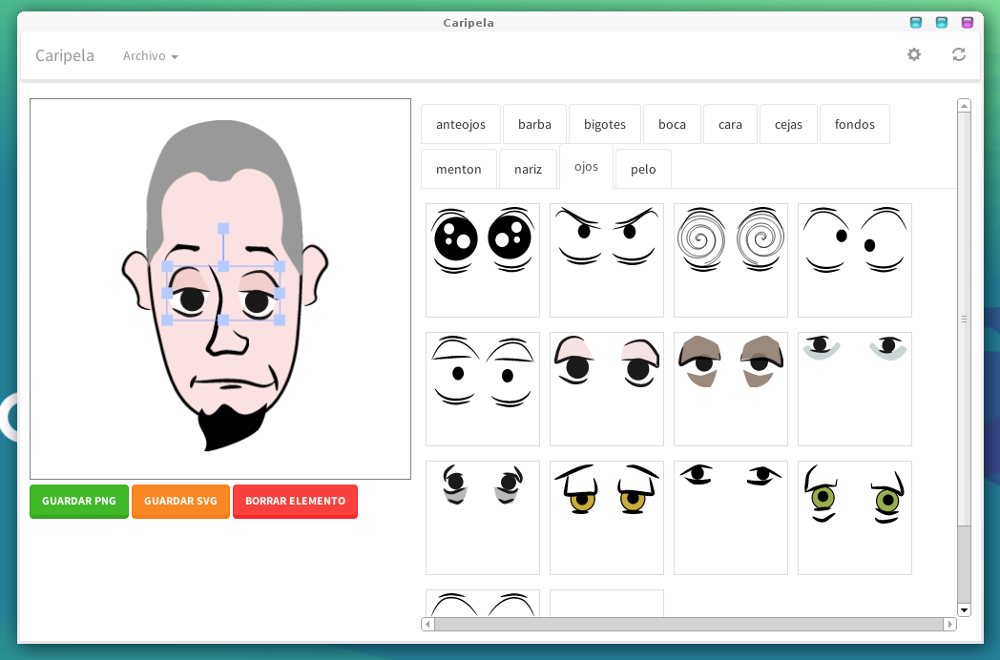

# Huayra-Avatar

Un programa sencillo para hacer avatares en huayra.

ACTUALIZACION: 
* Incluimos nuevos fondos
* Ahora también es posible generar memes sencillos :-)

## ¿Cómo ejecutarlo?

    git clone https://github.com/HuayraLinux/huayra-avatar.git
    npm install
    npm start

## Tecnologías utilizadas

* electron
* angularjs
* fabric
