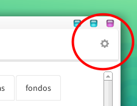
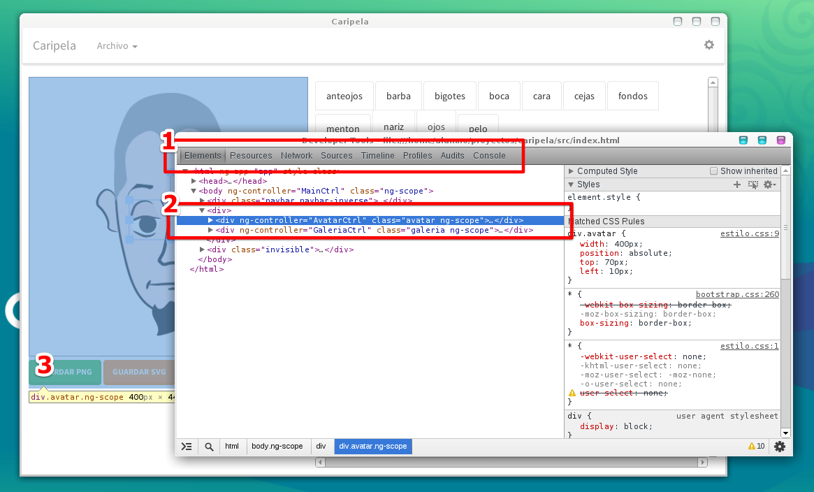

# ¿Cómo funciona Huayra-Avatar?

*Huayra-Avatar* está desarrollado utilizando una tecnología llamada *HTML5*.
Posiblemente te suene familiar, *HTML5* es un conjunto de tecnologías
que se utilizan generalmente para hacer aplicaciones *webs*.

Además, *Huayra-Avatar* es Software Libre, no solo se puede modificar y re-distribuir, sino
que además lo escribimos pensando en una estructura fácil de modificar y
que te permita poner en práctica muchas ideas.

Esta sección está dedicada a mostrar algunas ideas de diseño para que te
puedas familiarizar con el código y modificarlo. *HTML5* no es difícil, pero
puede ser un poquito intimidante al principio...

## Ok, ¿Cómo empezar?

Pensamos que una forma significativa de aprender sobre *Huayra-Avatar* y
cómo se puede modificar, es familiarizarse un poco con sus herramientas
de desarrollo.

Tal vez sea nuevo para vos, o no; pero de todas formas lo describo: *Huayra-Avatar*
incluye una herramienta de desarrollo, que te permite ver y modificar el programa
mientras está funcionando.

En la esquina superior derecha, debajo de los controles para minimizar, maximizar
y cerrar la ventana, aparece un ícono:

Una vez que se pulsa ese control, aparecen las herramientas de desarrollo, estas
herramientas son muy familiares para muchos desarrolladores, ya que son las
mismas que aparecen en el navegador web que
[usamos casi todas las personas](http://mashable.com/2013/08/14/google-chrome-global-share/)
(chromium/chrome).

Hay muchas cosas dentro de las herramientas de desarrollo, pero sin duda
está bueno destacar que a primera vista hay 3 componentes que casi siempre
usamos cuando estamos desarrollando:

1. Un selector de vistas.
2. El código HTML o estructura de la aplicación.
3. La vista actual de la aplicación, en este caso resaltando que hemos seleccionado un bloque en particular.

Esto hace sencillo poder ejecutar la aplicación, modificarla mientras está
en funcionamiento y hacer arreglos. Incluso desde las herramientas de desarrollo
muchas veces nos animamos a hacer experimentos y probar ideas, ¡es fácil!.

Así que aquí va la recomendación: abrí el inspector de la aplicación y comenzá
a explorar un poco lo que hay ahí. No te preocupes si mientras
cambiás cosas la aplicación deja de responder o algo así, todos los cambios
que se realizan en el inspector son temporales, no van a quedar grabados.

## Componentes

Una parte importante del funcionamiento de *Huayra-Avatar* son sus componentes: en
medio del desarrollo buscamos re-utilizar piezas de software que hicieran
una sola cosa, pero la hicieran bien. Así que usamos muchos componentes
diferentes, los vinculamos y escribimos código para que todo eso ocurra.

Te cito alguna de las herramientas que usamos y cómo:

* [nodewebkit](https://github.com/rogerwang/node-webkit) es la plataforma sobre la que contruimos la aplicación, *nodewebkit*
es similar a un navegador web, pero está dedicado a ejecutar aplicaciones; te
brinda un entorno para ejecutar código en lenguaje javascript, soporta todas
las bibliotecas de nodejs, y tiene el corazón de chromium.

* [angularjs](https://angularjs.org/) es una biblioteca para crear aplicaciones complejas en javascript,
nos brinda una estructura y varias herramientas para simplificar el diseño.

* [fabric](http://fabricjs.com/) es la herramienta de dibujado vectorial
que hace gran parte del trabajo, el panel izquierdo de la aplicación está a
cargo de esta biblioteca. Nos permite colocar objetos, transformarlos y
generar imágenes fácilmente.

* [bootstrap](http://getbootstrap.com/) es la biblioteca CSS que utilizamos
para construir la interfaz gráfica, simple pero efectiva :)

Hace tiempo *Hugo Ruscitti* (osea yo), dió una charla sobre cómo usar
*nodewebkit* para crear aplicaciones y
[está filmada en video](https://www.youtube.com/watch?v=TzDhzayO_uk). Si quieres
conocer un ejemplo práctico de utilización de estas herramientas es una
buena opción ver la charla.
